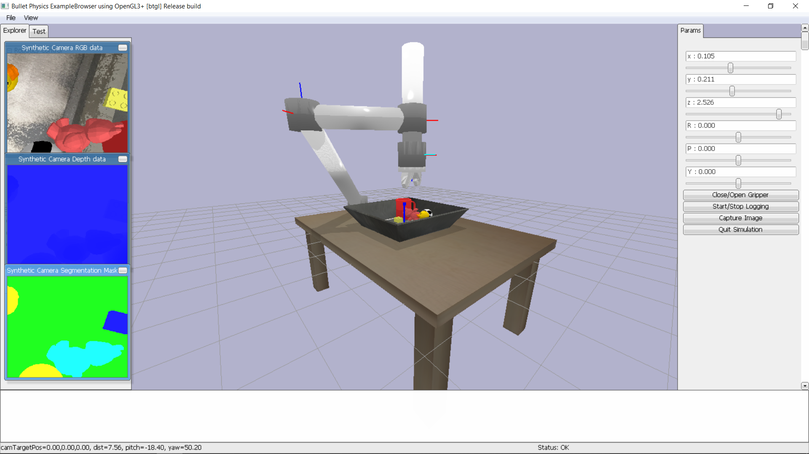
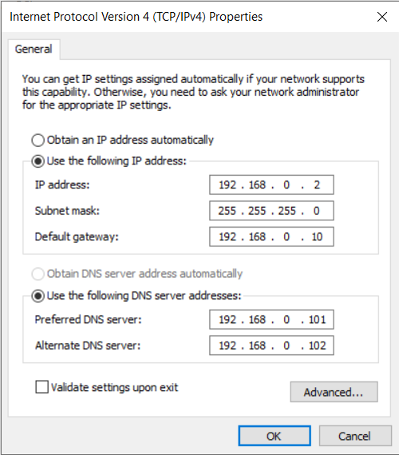
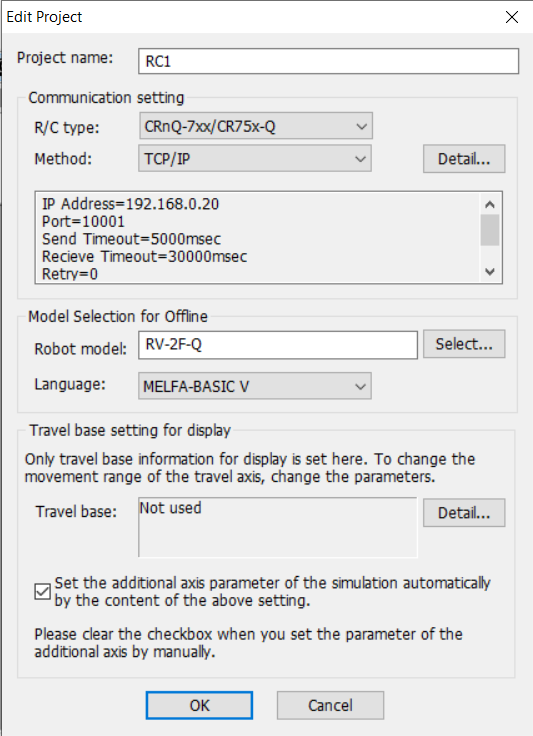

<div id="top"></div>

<!-- PROJECT LOGO -->
<br />
<div align="center">
  <a href="https://github.com/vasetrendafilov/robot-simulation">
    
  </a>

  <h3 align="center">Robot Arm Simulation</h3>

  <p align="center">
    Creating robot arms and simulating them in pybullet
    <br />
   
  </p>
</div>


<!-- TABLE OF CONTENTS -->
<details>
  <summary>Table of Contents</summary>
  <ol>
    <li>
      <a href="#about-the-project">About The Project</a>
      <ul>
        <li><a href="#built-with">Built With</a></li>
      </ul>
    </li>
    <li>
      <a href="#getting-started">Getting Started</a>
      <ul>
        <li><a href="#prerequisites">Prerequisites</a></li>
        <li><a href="#installation">Installation</a></li>
      </ul>
    </li>
    <li>
      <a href="#usage">Usage</a>
      <ul>
        <li><a href="#jupyter-notebooks">Jupyter notebooks</a></li>
        <li><a href="#data-structure">Data structure</a></li>
        <li><a href="#making-a-new-attachment">Making a new attachment</a></li>
        <li><a href="#importing-a-foreign-robot-arm">Importing a foreign robot arm</a></li>
        <li><a href="#making-a-new-pybullet-world">Making a new pybullet world</a></li>
        <li><a href="#connecting-with-mitsubishi-rv-2f-q-arm-to-rt-toolbox-2">Connecting with Mitsubishi RV-2F-Q arm to RT Toolbox 2</a></li>
      </ul>
    </li>
    <li><a href="#hotkeys-list-for-pybullet">Hotkeys list for pybullet</a></li>
    <li><a href="#roadmap">Roadmap</a></li>
    <li><a href="#contributing">Contributing</a></li>
    <li><a href="#acknowledgments">Acknowledgments</a></li>
    <li><a href="#license">License</a></li>
    <li><a href="#contact">Contact</a></li>

  </ol>
</details>


<!-- ABOUT THE PROJECT -->
## About The Project


Tha main goal of this project is to create a robot arm simulator where you can easily create or import an existing Unified Robot Description Format `urdf`, and interact with the robot in a simulated world with generated obstacles and challenges. The simulator I am using is `pybullet` which comes with all the necessary components to build an extensive and complicated simulated world. The backbone for creating the robot arm is made with `sympy` and the all the utilities are pulled from [fundamentals-of-robotics](https://gitlab.com/feeit-freecourseware/fundamentals-of-robotics). There are also dedicated packages for building the world around the robot arm and converting the Denavit–Hartenberg `DH` parameters to `urdf` so it can be imported in the simulation. In the `robot_arms/` section there
are real arms like [panda](https://www.franka.de/) and [xarm](https://www.ufactory.cc/xarm-collaborative-robot). Also there is the  Mitsubishi RV-2F-Q arm where the program can also convert the logs to RT Toolbox program file and run the program on the real arm.

### Built With

* [Pybullet](https://pybullet.org/)
* [Sympy](https://www.sympy.org/en/features.html)
* [Numpy](https://numpy.org/)

<p align="right">(<a href="#top">back to top</a>)</p>

<!-- GETTING STARTED -->
## Getting Started

### Prerequisites

For the software side to download the necessary packages you can choose [conda](https://docs.conda.io/en/latest/miniconda.html) or [pip](https://pypi.org/project/pip/), I will use conda in the installation part.

### Installation

1. Create environment
   ```sh
   conda create --name robot_simulation -c conda-forge pybullet jupyterlab sympy
   ```
2. Clone repo
   ```sh
   git clone https://github.com/vasetrendafilov/robot-simulation
   ```
3. Activate environment and run jupyter lab
   ```sh
   conda activate robot_simulation
   jupyter lab
   ```
<p align="right">(<a href="#top">back to top</a>)</p>

## Usage

### Jupyter notebooks

This project comes with three jupyter notebooks where there are provided examples of all the features:

* [custom_robot_arms](https://github.com/vasetrendafilov/robot-simulation/blob/main/custom_robot_arms.ipynb) where you can create custom robot arms using `DH` parameters, interact with them and calculate `DH` matrix and jacobian of the robot.

* [foreign_robot_arms](https://github.com/vasetrendafilov/robot-simulation/blob/main/foreign_robot_arms.ipynb) where you can import existing robot arms and interact with them.

* [Mitsubishi_robot_arm](https://github.com/vasetrendafilov/robot-simulation/blob/main/Mitsubishi_robot_arm.ipynb) where you interact with Mitsubishi RV-2F-Q arm, setup the robot to move trough code and convert the logs to RT Toolbox 2 program file.

### Data structure

When you save a new robot the program creates `robot_arms/robot_name/` directory and saves the `urdf` file. All the logs are saved in the same directory under the folder `logs`. When you add an attachment the file is expected to be in `attachments/attachment_name` and the libraries are expected to be under `packages`. The data structure three for running the project is: 

* attachments/
    * attachment_name/
        * attachment_name.urdf
* packages/
    * dh2urdf.py
    * pybullet_sim.py
    * robot_arm.py
    * utils.py
* robot_arms/
    * robot_name/
        * logs/
            * log_name_1.txt
            * ...
            * log_name_n.txt
        * program_name.pgr
        * robot_name.urdf
* my_program.ipynb

### Making a new attachment

To make a new attachment to be added to the robot arm  you have to follow this convention. Make a new folder in the attachments folder and put inside your relevant files, the main `urdf` has to be the same name with the folder and the first link in the file has to be called base. Then you have to check if your attachment is compatible with the function `actuate_attachment`, for now it's coded to open and close a gripper. For similar grippers you can just change the `attachment_open_targets` and  `attachment_close_targets`

### Importing a foreign robot arm

Make sure the file path for the meshes is correctly entered and remove any [xacro](http://wiki.ros.org/xacro) macros which does not work with pybullet. You have panda and xarm in the `robot_arms` directory as examples to compare. Also if the robot arm has an attachment rename the joint that connects it to the robot arm to `attachment_joint` so the program can correctly find the joint ids.

### Making a new pybullet world

Using the PybulletSimulation class in `pybullet_sim.py` you can make a new function to add objects to the simulation. For now I've just used the `urdf` files provided by pybullet and made the some basic objects like work table, tray and all the common objects found in the data provided by pybullet.

### Connecting with Mitsubishi RV-2F-Q arm to RT Toolbox 2

The communication between the pc and CR750-Q controller is trough ethernet cable. The cable is connected to the plc ethernet port of the CR750-Q and goes strait in the pc. The robot controller parameters for TCP/IP communication are already set. First in windows you have to go to `Control Panel > Network and Internet > Network and Sharing Center > Change adapter settings > Select the Ethernet Properties > Choose the TCP/IPv4 properties` and set the IPv4 Properties like the image bellow. In the RT Toolbox 2 program create a new project and copy the parameters from the picture bellow. 

<div style="display:flex">
     <div style="flex:1;padding-right:10px;">
          
     </div>
     <div style="flex:1;padding-left:10px;">
          
     </div>

</div>

## Hotkeys list for pybullet

|Action   |Operation	   |Instruction   |
|---|---|---|
| Open/close the search, test and params tabs |  g | Press g to toggle all tabs and menus|
| Suspend/restart physics simulation          |  i* | Press i to pause simulation |
| Profile dumping                             |  p | Press p to for profile dumping, prints or logs thread usage |
| Toggle ligths and shadows                   |  s | Press s to toggle lights and shadows |
| Toggle visual geometry                      |  v | Press v to toggle visualization of geometry faces |
| Toggle wireframe                            |  w | Press w to toggle wireframe mode |
| Exit app                                    |  Esc | Press Esc to exit the simulator |
| Move object                                 |  click + drag | click on an object within the simulation to apply a force |
| Rotate view                                 |  Ctrl + drag | When holding the Alt or Control key, left mouse click and drag rotates the camera |
| Translate view                              |  Ctrl + middle click | When holding the Alt or Control key, middle mouse click and drag moves the camera |
| Zoom view in/out                            |  mouseweel  |  Use the mouseweel to zoom in and out |
| Zoom view in/out                            |  Ctrl + right click | When holding the Alt or Control key, right mouse click and drag zooms camera in and out |
| Toggle image dump Physics Server            |  F1 | Press F1 to toggle image dump Physics Server (saves screenshots of the simulator to the /home directory continuously) |
| Save a 'testFile.bullet'                    |  F3* | Press F3 key in most of the Bullet examples to save a 'testFile.bullet' |

<p align="right">(<a href="#top">back to top</a>)</p>

<!-- ROADMAP -->

## Roadmap

- [x] Create `DH` representation of robot
    - [X] Add all types of joints
    - [x] Calculate `DH` matrix
    - [X] Calculate jacobian
    - [ ] Add internal values to link
- [x] Convert `DH` parameters to `urdf`
    - [X] Revolute joints
    - [x] Prismatic joints
    - [X] Fixed joints
    - [ ] Spherical joints
- [x] Interact with the robot
    - [X] Implement forward and inverse kinematics
    - [x] Use dynamics to control the joints
    - [X] Sliders for inverse and forward kinematics
    - [X] Sliders for inverse and forward kinematics
    - [X] Log every joint of the arm
    - [X] Capture image from the end effector
    - [X] Draw target and current trajectory
    - [X] Display current position and orientation
    - [X] Quit the simulation
    - [X] Gripper for the end effector
    - [ ] Another attachment module
- [x] Interpolation between two points
    - [X] Linear interpolation
    - [x] Circular interpolation
    - [X] Examples with drawing letters
    - [ ] Another types of interpolation
- [ ] Create more worlds in `pybullet_sim`
- [ ] Control the Mitsubishi robot arm directly
- [ ] Make a new class to control mobile robots
- [ ] Implement mobile robot arm from [pybullet examples](https://github.com/bulletphysics/bullet3/blob/master/examples/pybullet/examples/inverse_kinematics_husky_kuka.py)
- [ ] Implement the [tossing bot](https://pybullet.org/wordpress/index.php/2019/03/30/tossingbot-learning-to-throw-arbitrary-objects-with-residual-physics/)

<p align="right">(<a href="#top">back to top</a>)</p>

<!-- CONTRIBUTING -->
## Contributing

Contributions are what make the open source community such an amazing place to learn, inspire, and create. Any contributions you make are **greatly appreciated**. If you have a suggestion that would make this better, please fork the repo and create a pull request or uou can also simply open an issue. Don't forget to give the project a star! Thanks again!

1. Fork the Project
2. Create your Feature Branch (`git checkout -b feature/AmazingFeature`)
3. Commit your Changes (`git commit -m 'Add some AmazingFeature'`)
4. Push to the Branch (`git push origin feature/AmazingFeature`)
5. Open a Pull Request

<!-- ACKNOWLEDGMENTS -->
## Acknowledgments

* [fundamentals-of-robotics](https://gitlab.com/feeit-freecourseware/fundamentals-of-robotics) as the base for this project
* [DH2Urdf](https://akintokinematics.com/automatic-urdf-generation-from-dh-parameters/) improvement on this project
* [melfa_robot](https://github.com/tork-a/melfa_robot) copied and changed to work with Mitsubishi RV-2F-Q arm

<!-- LICENSE -->
## License

Distributed under the MIT License. See `LICENSE.txt` for more information.

<!-- CONTACT -->
## Contact

Vase Trendafilov - [@TrendafilovVase](https://twitter.com/TrendafilovVase) - vasetrendafilov@gmail.com

Project Link: [https://github.com/vasetrendafilov/robot-simulation](https://github.com/vasetrendafilov/robot-simulation)

<p align="right">(<a href="#top">back to top</a>)</p>